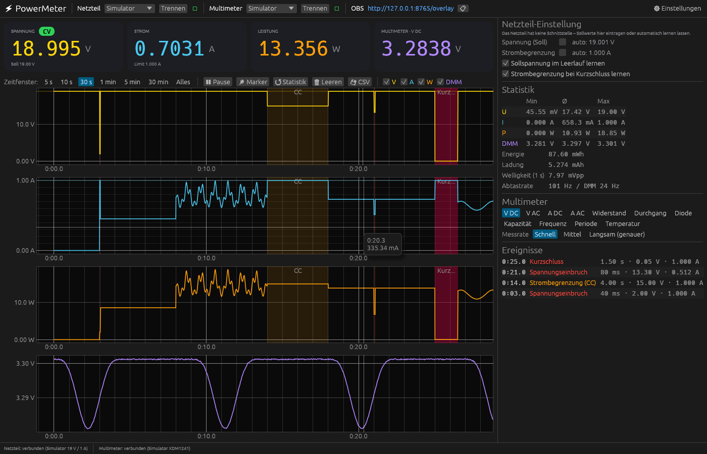
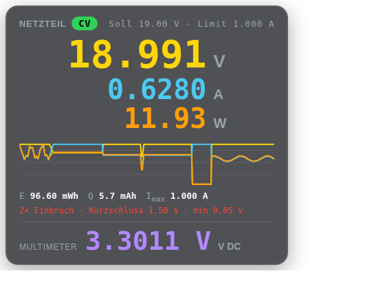
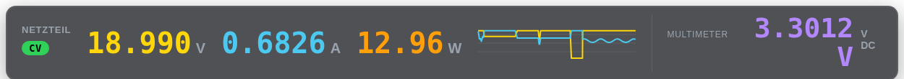

# ⚡ PowerMeter

Live-Messwerte von **Labornetzteil** und **Multimeter** auf dem Mac, mit Graphen, CV/CC-Erkennung, Spannungseinbrüchen und einem **OBS-Overlay** für Reparaturvideos.



## Was es kann

- **Netzteil-Werte live**: Spannung, Strom und Leistung mit 100 Messungen pro Sekunde, über das Messmodul zwischen Netzteil und Gerät ([Hardware & Einkaufsliste](docs/HARDWARE.md)).
- **OWON XDM1241** (auch XDM1041/2041) über USB/SCPI. Messfunktion und Messrate lassen sich aus der App umschalten, und Drehen am Gerät erkennt die App selbst.
- **Graphen** für U, I, P und das Multimeter mit gemeinsamer Zeitachse. Zeitfenster von 5 s bis „Alles“. Spitzen und Einbrüche gehen auch bei langen Zeitfenstern nicht verloren (Min/Max-Ausdünnung).
- **CV / CC** als Anzeige. Die Soll-Spannung und die Strombegrenzung lernt die App automatisch oder du trägst sie ein.
- **Ereignisse**: Spannungseinbrüche, Strombegrenzung und Kurzschlüsse werden im Graphen farbig hinterlegt und aufgelistet. Ein Klick auf ein Ereignis springt im Graphen dorthin.
- **Energie & Ladung** (Wh, mAh), Min/Ø/Max, Welligkeit (Vpp) und Spitzenstrom.
- **Marker** (Taste `M`) markieren Momente für den Videoschnitt.
- **OBS-Overlay** als Browser-Quelle mit transparentem Hintergrund, Kachel oder Leiste, inklusive Mini-Graph und Kurzschluss-/Einbruch-Warnung.
- **Kalibrierung** des Messmoduls gegen das Multimeter per Knopfdruck.
- **CSV-Export** (Taste `E`) nach `~/Documents/PowerMeter/`.
- **Simulator** für Netzteil und Multimeter: Alles lässt sich ohne Hardware ausprobieren.

## OBS einrichten

1. App starten. Oben steht die Overlay-URL `http://127.0.0.1:8765/overlay` (📋 kopiert sie).
2. In OBS: **Quellen → + → Browser**, die URL einfügen, Breite 700 und Höhe 400 eintragen.
3. Unter `http://127.0.0.1:8765/` gibt es eine Vorschau aller Varianten.

| Kachel | Leiste |
|---|---|
|  |  |

Die URL-Parameter lassen sich kombinieren:

| Parameter | Werte | Standard |
|---|---|---|
| `show` | `v,i,p,mode,set,graph,dmm,energy,events` | `v,i,p,mode,set,graph,dmm` |
| `layout` | `card`, `bar` | `card` |
| `graph` | Kurven im Mini-Graph: `v,i,p` | `v,i` |
| `accent` | größter Wert: `v`, `i`, `p` | `v` |
| `scale` | Größe, z. B. `1.5` | `1` |
| `bg` | Hintergrund-Deckkraft `0`–`1` | `0.72` |

Beispiel nur für das Multimeter, groß: `http://127.0.0.1:8765/overlay?show=dmm&scale=1.4`

Die Daten kommen per Server-Sent-Events mit bis zu 60 Aktualisierungen pro Sekunde. Rohdaten als JSON liefert `/api/live`.

## Latenz & Genauigkeit

- Das Messmodul (INA228, 20 Bit) mittelt intern 16 Messungen und schickt alle 10 ms einen Wert. Die App zeichnet ihn sofort im nächsten Frame.
- Die **großen Zahlen** mitteln standardmäßig über 100 ms, damit die letzte Stelle im Video lesbar bleibt. Unter ⚙ lässt sich das auf 0 (roh) stellen. **Graphen und Ereignisse arbeiten immer mit den Rohdaten.**
- Das Multimeter wird so schnell abgefragt, wie es antwortet (Messrate „Schnell“). Die App zeigt 5 signifikante Stellen (passend zu den 55 000 Counts des XDM1241), unter ⚙ einstellbar.

## Bauen

Voraussetzung: [Rust](https://rustup.rs).

```sh
cargo run --release              # starten
./scripts/bundle_macos.sh        # dist/PowerMeter.app (Apple Silicon + Intel)
```

Beim ersten Start einer selbst gebauten App: Rechtsklick → **Öffnen**. Jeder Push baut die App auch auf GitHub Actions (Artefakt „PowerMeter-macOS“).

## Tastenkürzel

| Taste | Aktion |
|---|---|
| Leertaste | Graph anhalten / weiter (angehalten: ziehen und zoomen) |
| `M` | Marker setzen |
| `R` | Statistik & Energie zurücksetzen |
| `E` | CSV-Export |

## Aufbau

```
src/
  main.rs            Fenster
  app.rs             Oberfläche (egui)
  model.rs           Messdaten, Analyse (CV/CC, Einbrüche, Energie)
  overlay.rs         Webserver für OBS (axum, SSE)
  export.rs          CSV
  devices/
    owon.rs          OWON XDM (SCPI über USB-Seriell)
    powermon.rs      Messmodul (INA228) über USB
    sim.rs           Simulatoren
assets/              Overlay-HTML
firmware/powermon/   Arduino-Firmware fürs Messmodul
docs/HARDWARE.md     Einkaufsliste & Verdrahtung
```

Inspiriert von [rusty_meter](https://github.com/markusdd/rusty_meter).
